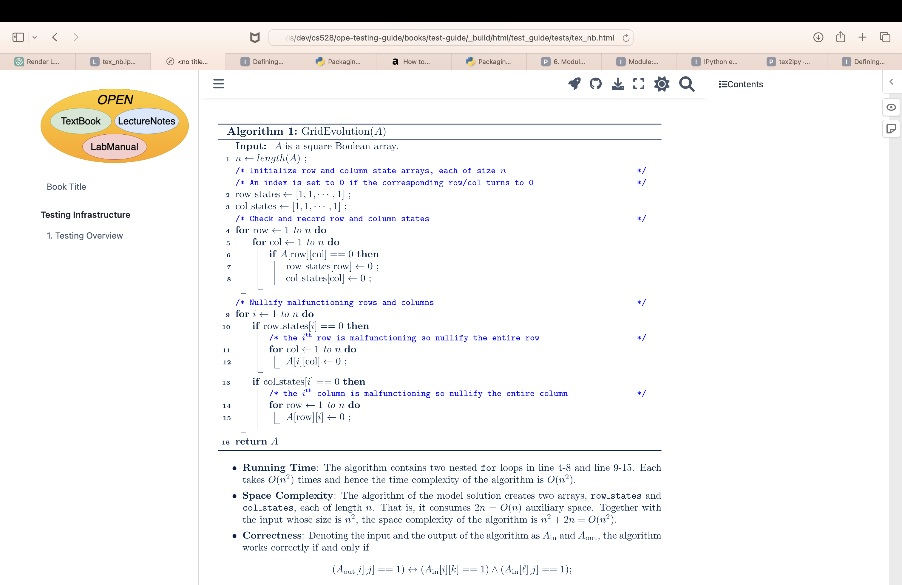
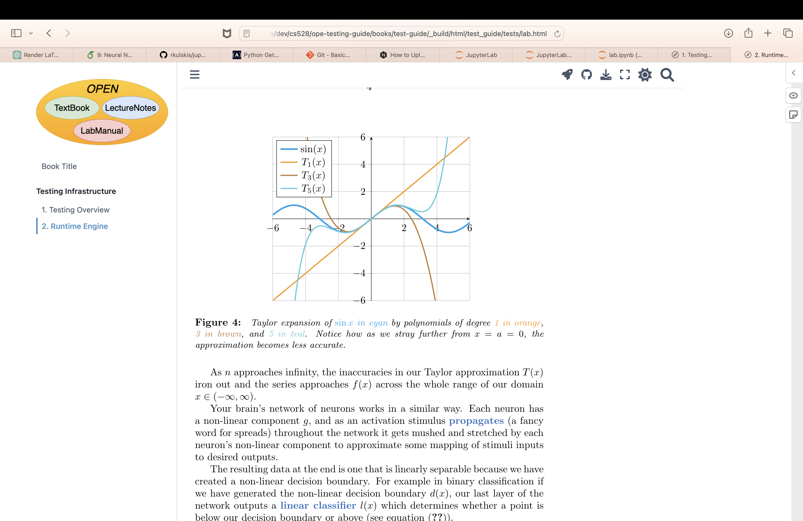

# Why jupytex?
This is a python package for rendering LaTeX in Jupyter notebook with native 
rendering capabilities. Jupyter uses MathJax to render LaTeX inside of 
Markdown cells, which is fine for most use cases; however, this does not 
provide the full set of tools that LaTeX has to offer (e.g. tikzpictures,
complex figures). What we want is the ability to write content using Jupyter
for dynamic content while not sacrificing the beauty of native LaTeX.

# How Does it Work?
This is a custom ipython [magic plugin](https://ipython.readthedocs.io/en/stable/config/custommagics.html)
which allows users to create a new code cell, placing `%%tex` at the top and 
then put all of their LaTeX source code afterwards. Running the cell compiles
the code into `.svg` format which is displayed following the cell.

Jupytex uses `pdflatex` to compile your cell's code into PDF format, then
`pdfcrop` to crop the content, and `pdf2svg` to convert the PDF to `.svg`
format. Then this is displayed using the IPython module. The compilation is
fast, and has the upside of your LaTeX not needing to be rendered with
Javascript when viewed on the web. 

The `.svg` format is great because it doesn't lose any definition upon
zooming in on the compiled LaTeX and you can highlight text with your cursor,
which you cannot do with normal image formats like PNG/JPEG.

# Usage
1. run `pip install jupytexmagic`
2. create a new cell with `import jupytexmagic` and `%load_ext jupytexmagic`
3. have fun! for tex cells, place `%%tex` at the top of your cell **Note: see test/jupytexmagic.ipynb for an example run**
4. Currently the document class is standalone with variable height `\documentclass[varwidth, margin=1in]{standalone}` and has page numbers turned off `\pagenumbering{gobble}` but other than that, you can fully customize the output. This is needed so that the rendering of the svg is continous similar to how Jupyter renders markdown.

If your tex compilation fails, you can use the `%%texdebug` magic command
to display the output of `pdflatex` when compiling for debugging purposes.

# Current Limitations
Because jupytex presents the compiled LaTeX in `.svg` format, it assumes
a standard page layout. Currently `texify()` crops to content; although there
are slight things that are off about the margins. The goal is to fix this in
the next release!

For some reason, the compilation does not work properly with JupyterNotebook;
however, it works just fine with JupyterLab. Currently uploading the source
`.ipynb` files ruins the view on GitHub, but displaying and building inside
a Jupyter Book works properly (see images attached in [example run screenshots](#Example Run Screenshots)

# Tests directory
Currently this directory contains a screenshot and `lab.ipynb`, which are
Jupyter example runs. Some ideas for testing could be to use selenium for 
screenshotting and comparing images with known working versions.

# Example Run Screenshots

